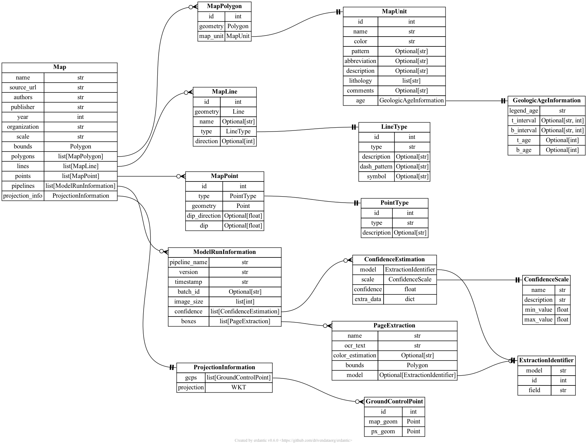

# TA1 schemas

## Output schemas

This proposed structure for TA1 output schemas contains feature extraction models (*MapPolygon*, *MapPoint*, *MapLine* and associated types) heavily based on Macrostrat's database schemas for storing geologic map information.

### Summary

TA1 output schemas are defined in the [TA1 output JSONSchema](output-schemas.json) file.

The JSON schemas were compiled using [`pydantic`](https://docs.pydantic.dev/latest/) model builder in Python, which provides a terse API. This also allows an entity-relationship diagram to be generated.

Documentation of each schema: [TA1 output schema documentation](output-schemas.md)