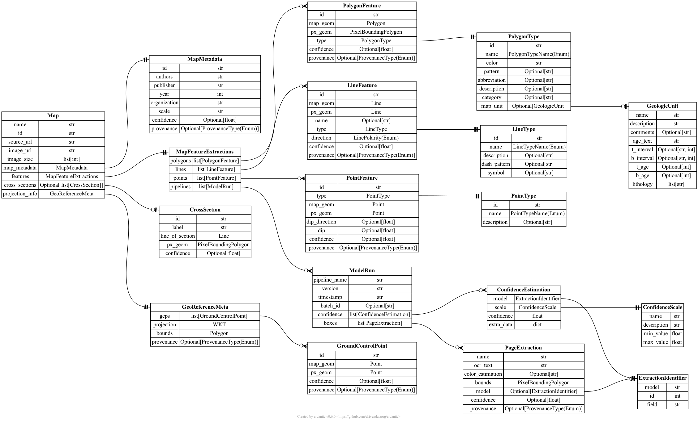

# TA1 schemas

## Output schemas

*Data provided by TA1 performers to TA4 for feedback/synthesis*

TA1 output schemas are defined in the [TA1 output JSONSchema](output.json) file.

The JSON schemas were compiled using [`pydantic`](https://docs.pydantic.dev/latest/)
model builder in Python, which provides a terse API for JSON schema construction.
This also allows an entity-relationship diagram to be generated.

Documentation of each schema: [**TA1 output schema documentation**](output.md)

### Elements

#### MapFeatureExtractions

This set of models describes geographic features extracted from the map and their legend descriptions. The structure of this
schema unit is set up to closely mimic the structure of a typical attribute table for a vector geologic map.

*Notes:* The line types, age intervals, lithologies, and unit names should ideally
be checked against a controlled vocabulary (which can be provided by Macrostrat's API or pre-defined). See [example line types](example-data/example-line-types.txt)
for an example of typical line types.

#### CrossSection

Information about the map's cross-sections.

*Notes*: Nice to have, but not required.

#### ProjectionMeta

Information about the map's projection and ground control points.

#### ModelRun

Information about ML model runs, including confidence estimations, page extraction bounding boxes/OCR text, and versioning/provenance metadata.

*Notes*: The **ExtractionIdentifier** schema represents a pointer to a specific piece of extracted information, such as `MapUnit[23]->lithology` or `PolygonFeature[15]->geometry`.

## Feedback schemas

*Data provided to TA1 performers by TA4 for feedback*

TBD