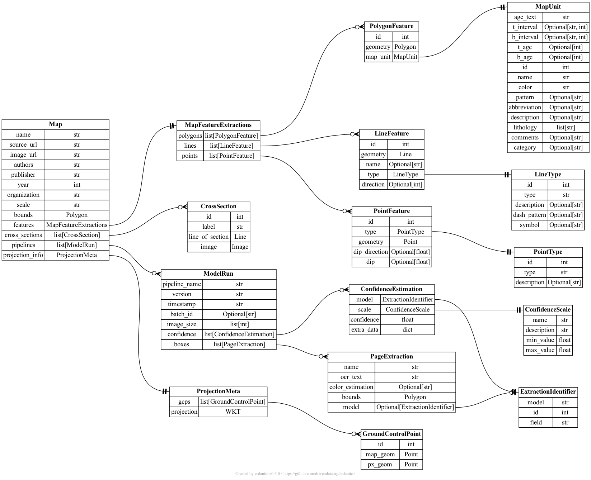

# TA1 schemas

This is a proposed structure for TA1 output schemas. The structure of information for feature extractions (*MapPolygon*, *MapPoint*, *MapLine* and associated types) is heavily based on Macrostrat's database schemas for storing geologic map information.

## Output

TA1 output schemas are defined in the [TA1 output schema](output-schemas.json) file.

### Summary

Documentation of each schema: [TA1 output schema documentation](output-schemas.md)