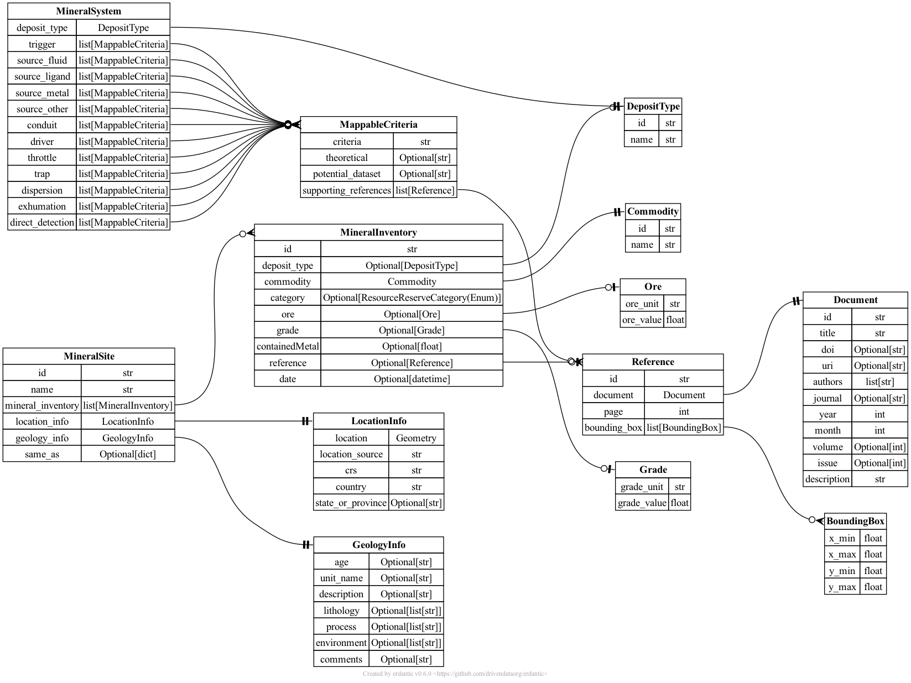

# TA2 schemas

## Output schemas

*Data provided by TA2 performers to TA4 for feedback/synthesis*

TA1 output schemas are defined in the [TA2 output JSONSchema](output.json) file.

Documentation of each schema: [**TA2 output schema documentation**](output.md)

### MineralResourceSite

A work in progress, borrowed from UW–Macrostrat's work to 
import [MRDS](https://mrdata.usgs.gov/mrds/) data into Macrostrat (see [our development website](https://dev.macrostrat.org/map/weaver) and [code](
https://github.com/digitalcrust/weaver/blob/main/example-pipelines/mrds/02-get-data.py))

### MineralDepositModel

TBD

### GradeTonnageModel

TBD

## Feedback schemas

*Data provided to TA2 performers by TA4 for feedback*

TBD