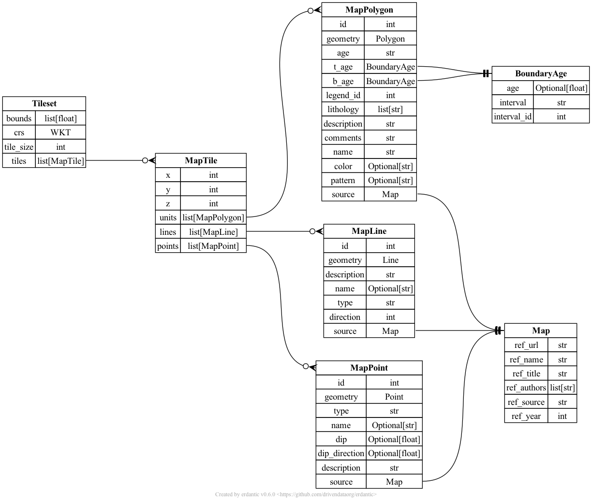

# TA3 schemas

## Input schemas

*Data provided by TA1-2 and TA4 systems to TA3 for mineral system modeling*

TA3 input schemas are defined in the [TA3 input JSONSchema](input.json) file.

Documentation of each schema: [**TA3 input schema documentation**](input.md)

### Geological map data

Basic structure borrowed from UW–Macrostrat's [`carto` tileset](https://dev.macrostrat.org/map/dev/carto). This schema is an alternative way
to organize geologic mapping data (compared to [TA1 output](../ta1/README.md)). It is a "flat" representation of geologic information that potentially
merges and harmonizes results from many maps.

We propose to provide geologic information in the [Mapbox Vector Tile](https://docs.mapbox.com/vector-tiles/reference/) format, which is a compact binary representation suitable for web-based visualization and multiscale data structures. Depending on data IO formats, we may experiment with the [PMTiles](https://protomaps.com/docs/pmtiles) container format, which is a generalization of
Mapbox Vector Tiles for random read that is analogous to Cloud-Optimized GeoTIFFs.

### Other TA3 inputs

TBD

## Output schemas

TBD - *Raster mineral prospectivity maps?*

## Feedback schemas

*Data provided to TA4 performers by TA4 for feedback*